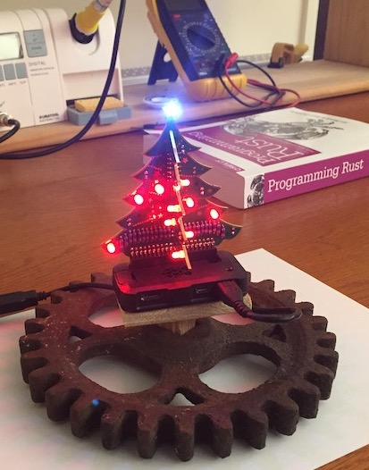

# RustPiXmas -- A simple rust program to twinkle Christmas tree



I bought a [3D Xmas Tree for Raspberry Pi](https://thepihut.com/products/3d-xmas-tree-for-raspberry-pi)
and assembled it using [these instructions](https://thepihut.com/blogs/raspberry-pi-tutorials/3d-xmas-tree-for-raspberry-pi-assembly-instructions).

It is plugged onto a Raspberry Pi Zero, mounted on an appropriately shaped metal base
(part of an old argicultural feed drill).

I then wrote a simple Rust program to make the lights flash.
I cross-compile from my Mac, with [Ragnaroek's rust-on-raspberry-docker](https://github.com/Ragnaroek/rust-on-raspberry-docker) container, then use [build.sh](./build.sh) to build and deploy the binary. On Linux it builds without any tricks.

## Installing

To run it automatically on the Pi, I added a [simple systemd service](rustpixmas.service).
Install with:
```
sudo cp rustpixmas.service /etc/systemd/system/
sudo systemctl daemon-reload
sudo systemctl enable rustpixmas.service
sudo systemctl start rustpixmas.service
sudo journalctl -u rustpixmas.service
```

or use [Docker](./docker/README.md].

## License

Copyright 2018 Martijn Koster

Licensed under the Apache License, Version 2.0 (the "License");
you may not use this file except in compliance with the License.
You may obtain a copy of the License at

       http://www.apache.org/licenses/LICENSE-2.0

Unless required by applicable law or agreed to in writing, software
distributed under the License is distributed on an "AS IS" BASIS,
WITHOUT WARRANTIES OR CONDITIONS OF ANY KIND, either express or implied.
See the License for the specific language governing permissions and
limitations under the License.
